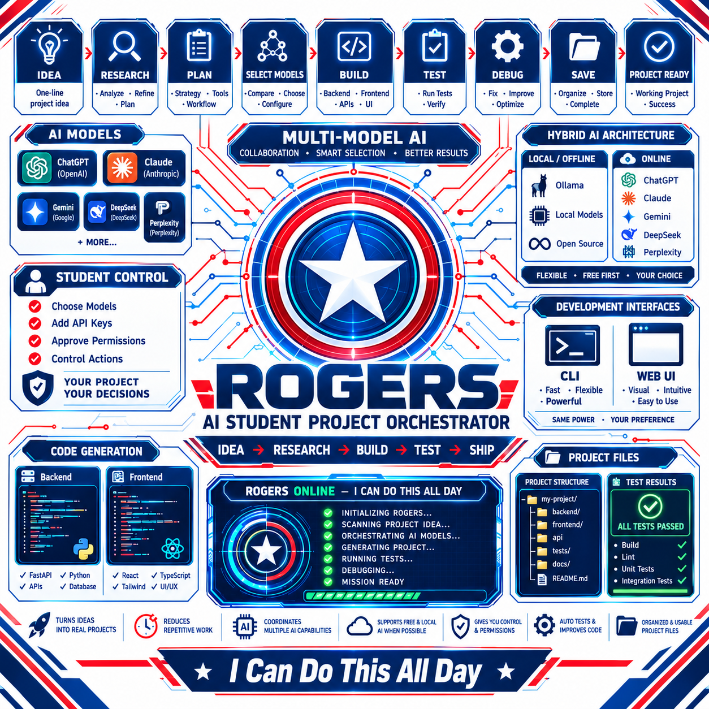

 <p align="center">
  
</p>

<h1 align="center">ROGERS — AI Student Project Orchestrator</h1>

<p align="center">
  <strong>IDEA → RESEARCH → BUILD → TEST → SHIP</strong>
</p>

<p align="center">
  An intelligent AI-powered platform that transforms a student's project idea into a complete, tested, and organized software project.
</p>

---

## 🚀 About ROGERS

ROGERS is an AI Student Project Orchestrator designed to help college students turn a one-line project idea into a practical, working software project.

It researches and refines ideas, recommends suitable AI tools, coordinates multiple AI models, generates backend and frontend code, automatically tests and debugs the project, and saves the completed result to the student's selected project folder.

## ✨ Key Features

- 💡 **Idea to Project** — Transform a one-line idea into a complete project.
- 🔎 **AI Research** — Research, analyze, and refine project concepts.
- 🤖 **Smart AI Recommendations** — Compare suitable free and paid AI tools.
- 🧠 **Multi-Model Collaboration** — Coordinate multiple AI models when suitable.
- 🔐 **Human Approval** — Keep students in control of model selection, permissions, and important actions.
- ⚙️ **Complete Project Generation** — Build backend, frontend, APIs, and supporting files.
- 🧪 **Automatic Testing** — Verify that the generated project works.
- 🛠️ **Debugging and Repair** — Detect errors and attempt fixes.
- 📁 **Project File Management** — Organize and save completed project files.
- 🌐 **Hybrid AI Architecture** — Support local/offline and online AI providers.
- 💻 **CLI and Web Interface** — Offer flexible development workflows.

## 🔄 Project Workflow

```text
IDEA → RESEARCH → PLAN → SELECT MODELS
     → BUILD → TEST → DEBUG → SAVE
     → PROJECT READY
```

## 🎯 Mission

Help students move beyond a simple idea and develop real, usable software through AI-powered research, engineering, testing, and automation.

<p align="center">
  <strong>“I Can Do This All Day”</strong>
</p>

# 🛡️ ROGERS

### AI Project Orchestration Engine for Students

> **Give ROGERS one project idea. Build it step by step.**

ROGERS is an open-source AI project orchestration engine designed for college students and developers.

The goal is simple:

**Turn a project idea into a structured, technically sound, runnable project — with AI assistance and human control at every important stage.**

ROGERS is inspired by the mission-briefing experience of **Captain America / Steve Rogers**: focused, persistent, team-oriented, and built to keep moving forward.

---

## 🎯 Vision

A student should not need to know everything before starting a project.

They should be able to describe an idea and let ROGERS help them move through:

```text
Project Idea
     ↓
Research & Analysis
     ↓
Requirements
     ↓
Architecture
     ↓
Technology Stack
     ↓
Development Roadmap
     ↓
Human Approval
     ↓
Runnable Project Scaffold
     ↓
Feature Implementation
     ↓
Testing
```

The long-term goal is to make ROGERS capable of orchestrating the entire software-development lifecycle while keeping the developer in control.

---

# 🛡️ Current Status

ROGERS is actively under development.

### Completed

- [x] Project creation from an idea
- [x] Structured project blueprint generation
- [x] Research & analysis stage
- [x] Requirements engineering stage
- [x] System architecture stage
- [x] Technology stack stage
- [x] Development roadmap stage
- [x] Human approval workflow
- [x] Modify stage decisions
- [x] Regenerate stages with guidance
- [x] Downstream context propagation
- [x] Persistent project storage
- [x] Multi-project management
- [x] Project scaffolding
- [x] JSON and Markdown blueprint export
- [x] Provider abstraction
- [x] Automated test suite
- [x] FastAPI backend
- [x] React + TypeScript frontend

### 🚧 In Development

- [ ] Blueprint → real feature implementation
- [ ] Safe code generation and modification
- [ ] Automated validation
- [ ] Testing and automatic fixing
- [ ] GitHub integration
- [ ] Plugin system
- [ ] Intelligent model/provider routing
- [ ] Multi-agent execution
- [ ] Deployment automation

---

# 🤖 AI Orchestration

ROGERS is designed around specialized AI roles rather than forcing one model to perform every task.

The long-term mission structure is:

| Mission     | Role                    | Example Providers        |
| ----------- | ----------------------- | ------------------------ |
| 🕵️ Recon    | Research & intelligence | Perplexity, Groq, Ollama |
| 🔥 Backend  | Backend engineering     | Claude, OpenAI, Ollama   |
| ⚡ Frontend | Frontend engineering    | OpenAI, Ollama           |
| 🛡️ Testing  | Testing & verification  | DeepSeek, Ollama         |

The provider layer is intentionally flexible.

Users should be able to choose the models they want instead of being locked into a single AI provider.

---

# 🧠 Human-in-the-Loop

ROGERS does not blindly execute every AI decision.

Important stages can be reviewed and modified by the developer.

For example:

```text
AI recommends PostgreSQL
        ↓
Developer reviews
        ↓
Developer changes it to SQLite
        ↓
ROGERS updates downstream decisions
        ↓
Architecture and roadmap adapt
```

This keeps the developer in control of the project.

---

# 🏗️ Architecture

Current technology stack:

### Backend

- Python 3.10+
- FastAPI
- Pydantic
- Uvicorn
- JSON-based persistent project storage

### Frontend

- React
- TypeScript
- Vite
- Tailwind CSS
- Lucide Icons

### AI Providers

- Built-in offline provider
- Groq
- OpenAI
- Ollama
- OpenAI-compatible endpoints

### Testing

- Pytest

---

# 📁 Project Structure

```text
ROGERS/
│
├── backend/
│   ├── app/
│   │   ├── models.py
│   │   ├── storage.py
│   │   ├── orchestrator.py
│   │   ├── scaffolder.py
│   │   ├── main.py
│   │   ├── providers/
│   │   └── routes/
│   │
│   └── requirements.txt
│
├── frontend/
│   ├── src/
│   │   ├── api/
│   │   ├── components/
│   │   ├── App.tsx
│   │   └── types.ts
│   └── dist/
│
├── generated_projects/
│
├── tests/
│
├── run.py
├── README.md
├── LICENSE
└── .gitignore
```

---

# 🚀 Running ROGERS Locally

## 1. Clone the repository

```bash
git clone https://github.com/YOUR_USERNAME/ROGERS.git
cd ROGERS
```

## 2. Create the Python environment

### Windows

```powershell
python -m venv .venv
```

Activate it:

```powershell
.\.venv\Scripts\Activate.ps1
```

## 3. Install backend dependencies

```powershell
pip install -r backend\requirements.txt
```

## 4. Configure environment variables

Create a local `.env` file:

```env
GROQ_API_KEY=
OPENAI_API_KEY=
ANTHROPIC_API_KEY=
PERPLEXITY_API_KEY=
```

API keys are optional depending on the provider being used.

**Never commit your `.env` file to GitHub.**

## 5. Start ROGERS

```powershell
python run.py
```

Then open:

```text
http://127.0.0.1:8000
```

---

# 🔐 Security

ROGERS follows a **Bring Your Own Key (BYOK)** approach.

API keys should:

- Stay on the user's machine
- Be stored locally in `.env`
- Never be committed to Git
- Never be displayed in logs
- Never be stored by a ROGERS server

Example:

```text
.env
```

is private.

```text
.env.example
```

can safely be committed.

---

# 🧪 Testing

Run the test suite:

```powershell
pytest tests/ -v
```

The current test suite covers:

- Health checks
- Provider detection
- Input validation
- Complete blueprint generation
- Domain adaptation
- SPA serving
- Multi-stage orchestration
- Human modification
- Downstream context propagation
- Project scaffolding

---

# 🛡️ ROGERS Design Philosophy

ROGERS should feel less like a generic enterprise dashboard and more like a **mission-control system**.

The interface direction is inspired by:

- 🛡️ Shield geometry
- ⭐ Star motifs
- 🔵 Deep blue command-center surfaces
- 🔴 Red mission indicators
- ⚪ White/silver information elements
- 🎬 Cinematic orchestration
- 🤖 AI agents working as a team

Future UI work will include a **shield-inspired loading and progress animation** for AI orchestration.

The goal is:

> **A Captain America mission briefing × futuristic AI command center × developer workstation.**

---

# 🗺️ Roadmap

## Phase 1 — Foundation

- [x] Project creation
- [x] Blueprint generation
- [x] Multi-stage orchestration
- [x] Human review
- [x] Persistent project memory
- [x] Project scaffolding

## Phase 2 — Implementation

- [ ] Select development task
- [ ] Generate implementation
- [ ] Modify project files safely
- [ ] Validate generated code
- [ ] Display implementation results

## Phase 3 — Verification

- [ ] Automated tests
- [ ] Failure detection
- [ ] AI-assisted fixing
- [ ] Regression validation

## Phase 4 — Developer Integrations

- [ ] GitHub integration
- [ ] Git commits
- [ ] Pull requests
- [ ] Plugin system
- [ ] External tools

## Phase 5 — Advanced Orchestration

- [ ] Intelligent model routing
- [ ] Parallel agents
- [ ] Advanced project memory
- [ ] Deployment automation
- [ ] Full project lifecycle orchestration

---

# 💡 Why ROGERS?

College students often have project ideas but struggle with:

- Where to start
- Choosing the right technology
- Designing the architecture
- Building the backend
- Connecting the frontend
- Writing tests
- Organizing the project

ROGERS aims to turn that uncertainty into a structured mission.

```text
IDEA
 ↓
PLAN
 ↓
BUILD
 ↓
TEST
 ↓
SHIP
```

One project.

One mission.

One orchestrated team.

---

# 📜 License

ROGERS is open source software released under the **MIT License**.

---

## ⭐ The Mission

> **"I can do this all day."**

ROGERS is being built to help students go from:

**"I have an idea."**

to:

**"I built it."**

# 🛡️ **ROGERS — Assemble.**

# ROGERS
